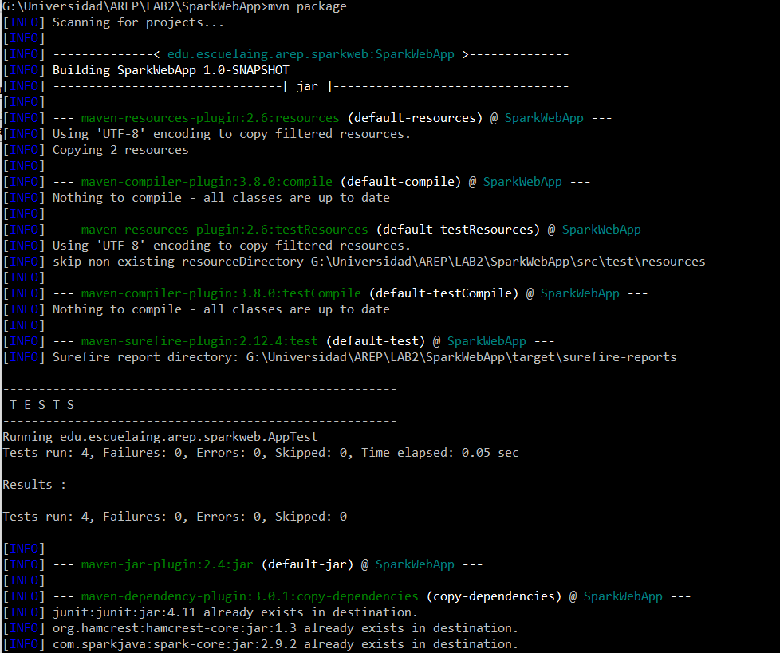
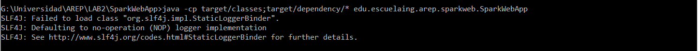
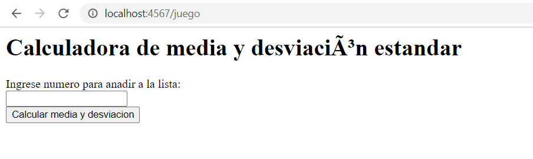
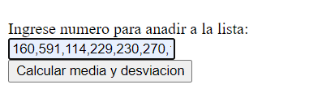
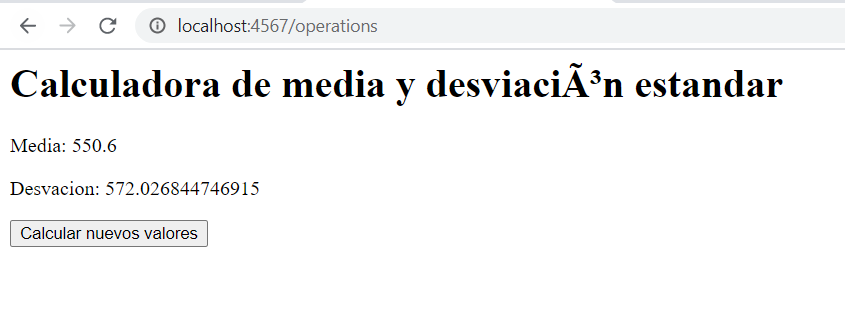
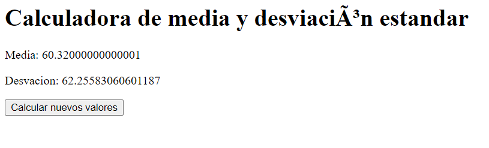

## Autor: Daniel Felipe Alfonso Bueno 
## Profesor: Luis Daniel Benavides 
## AREP - Arquitectura Empresarial
## Prerrequisitos 
Se debe tener instalado JAVA JDK 8 o superior y MVN.

[¡Link de la aplicación desplegada en Heroku!](https://arcane-earth-96304.herokuapp.com/juego)

### Calculo de la media. 
Realizamos una sumatoria de todos los datos que tenemos y lo dividimos entre el número 
total de datos 
### Calculo de la desviación estándar 

Realizamos la sumatoria de la resta de cada valor menos el resultado que obtuvimos de la media, dividido
el número total de datos menos uno y a todo este resultado sacamos raíz cuadrada

### Implementación lista enlazada (LinkedList)

Es una estructura lineal que almacena una colección de elementos generalmente
son nodos en donde cada uno almacena datos y una referencia a otros nodos así cada uno 
puede encontrarse de manera sencilla en la memoria. Son una estructura de datos dinámica
se utiliza para almacenar datos que cambian constantemente ya que son muy flexibles porque 
se expanden o contraen según el almacenamiento de los datos. 
Las operaciones que implemente en esta lista fueran add y remove(por derecha) y método iterator
para recorrer de manera sencilla nuestra estructura de datos con un ciclo. Esto lo extendemos de la interfaz List 
para integrarlo al API de JAVA

## Diseño 
En el archivo AREP Design podremos encontrar la metafora de diseño, la explicación del modelo de clases y diagrama de componentes realizado.

## Uso del proyecto 
Para ejecutar nuestro proyecto, procederemos a clonarlo del repositorio de GitHub
en el siguiente link https://github.com/DanielAlfonso17/AREP-LAB2.git desde la terminal de comandos
de la siguiente manera
~~~
git clone https://github.com/DanielAlfonso17/AREP-LAB2.git
~~~
Después nos movemos al directorio donde está ubicado nuestro proyecto y en consola 
ejecutamos mvn para compilar 
~~~
mvn package 
~~~

Para ejecutar nuestro proyecto y en especifico nuestro servidor web de SparkWeb
~~~
java -cp target/classes;target/dependency/* edu.escuelaing.arep.sparkweb.SparkWebApp
~~~
Como resultado de la ejecución podremos observar lo siguiente en consola 

Podemos genera la documentación del proyecto con el comando 
~~~
mvn javadoc:javadoc
~~~
El archivo de documentación se encuentra en la raiz del repositorio con nombre Documentacion.html

Para acceder al servicio SparkWeb en nuestro navegador pondremos la siguiente dirección para acceder a la aplicación 

## Ejecucion de pruebas 
Podemos ejecutar para la realización de las pruebas:  
~~~
mvn package ó mvn test
~~~
El resultado de las pruebas es exitoso como podemos ver. 

Se probaron los casos entregados en el documento del trabajo se anexan algunos pantallazos con los resultados, estos casos se encuentran en la clase AppTest.java realizados con la implementación de LinkedList

Como se muestra en el navegador 

#### Prueba 1

#### Prueba 2

